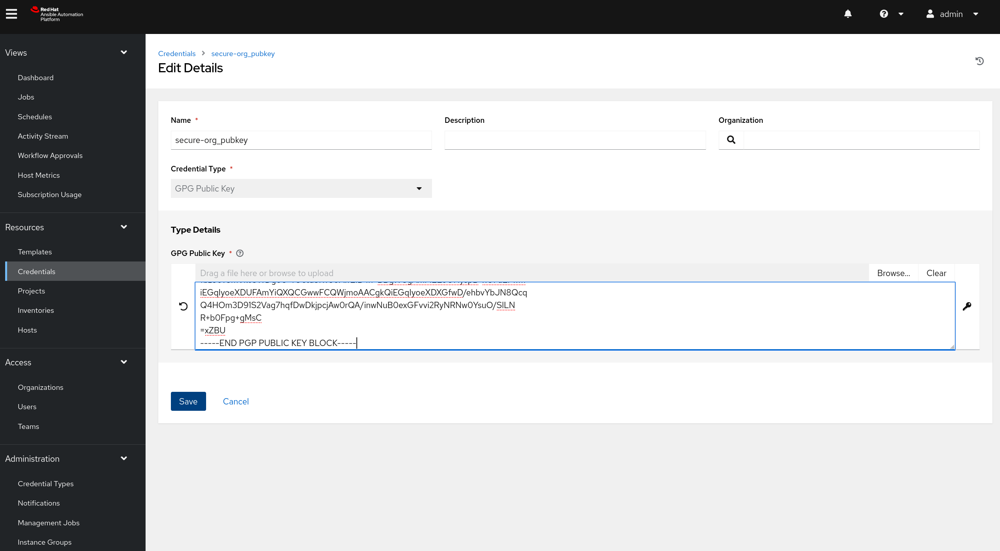
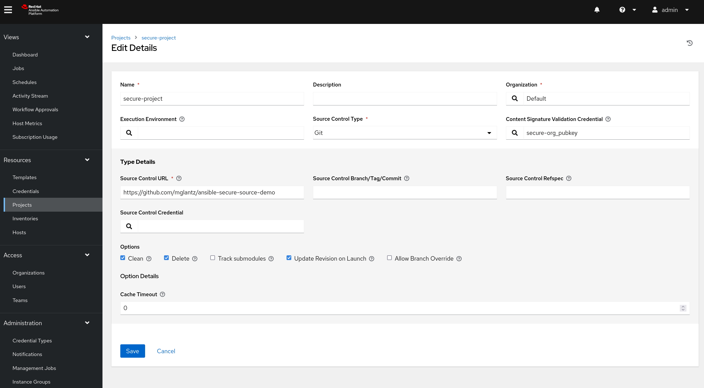
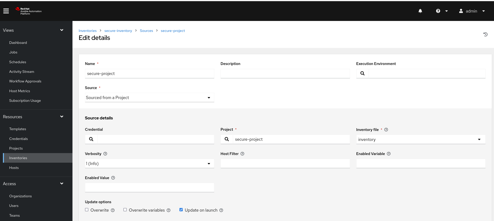
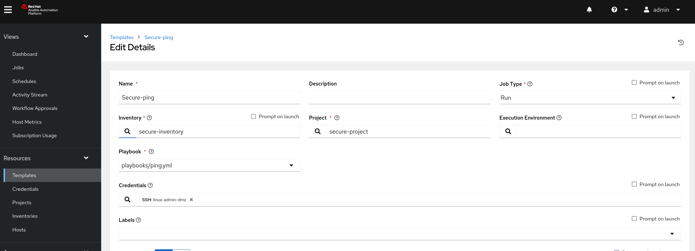
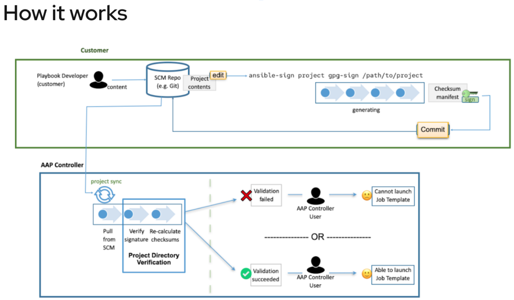

# Demonstration of ansible-sign
To demonstrate Ansible Automation Platforms source validation features:

1. Copy the public key available in this repository, available here: [https://raw.githubusercontent.com/mglantz/ansible-secure-source-demo/main/secure-org_pubkey.asc](https://raw.githubusercontent.com/mglantz/ansible-secure-source-demo/main/secure-org_pubkey.asc)

2. Create a new set of credentials, use GPG key as type and paste in the key you copied in step 1.


3. Create a new project and define the GPG key, ensure to enable "Update revision on project launch".


4. Create an inventory with your project as source. When adding the source, select "Update on launch" to ensure you force a project sync before inventory is used.


5. Create a job template using the playbooks/ping.yml playbook connected to the inventory you just created.


6. Run the job template.

7. Show how the related playbook (ping.yml) now is cryptographically validated before getting run, along side with the inventory source you run against. Review run jobs to show the Source Control Update triggered by your job template run.


8. Show the validation which happened during the Source Control Update of your project.


## How ansible-sign works with Ansible Automation Platform


The workflow for ansible-sign is as follows:
1. User create a new gpg keypair and exports the public key, for use in AAP. In our example below saved as secure-org_pubkey.asc
```
$ gpg --generate-key
<Output omitted>
$ gpg --list-keys
[keyboxd]
---------
pub   ed25519 2024-04-19 [SC] [expires: 2027-04-19]
      A0E1F2B2907EC4615A105C268841AA232A1E5C35
uid           [ultimate] Secure Org <secure-org@localhost.localdomain>
sub   cv25519 2024-04-19 [E] [expires: 2027-04-19]

$ gpg --export --armour A0E1F2B2907EC4615A105C268841AA232A1E5C35 >secure-org_pubkey.asc
```
2. User checks out a git repository and potentially creates files to protect (inventory, playbooks, etc)
3. User creates the MANIFEST.in file and the .ansible-sign directory in the root of the project directory. MANIFEST.in file needs to include and include or an exclude statement covering all files. Example for our demo repostitory is:
```
include inventory
recursive-include playbooks *.yml
recursive-include playbooks *.yaml
include *.yml
include *.yaml
include MANIFEST.in
include README.md
include secure-org_pubkey.asc
recursive-include images *.png
exclude .ansible-lint
exclude .gitignore
recursive-exclude .git *
```
5. User runs ```ansible-sign project gpg-sign .``` inside of the project directory, which causes ansible-sign to read the MANIFEST.in file and generate the ```.ansible-sign/sha256sum.txt```  and ```.ansible-sign/sha256sum.txt.sig```
Read more here: https://docs.ansible.com/automation-controller/latest/html/userguide/project-sign.html 

6. User does a git add on any files changed, including the two files in .ansible-sign/ the commits and pushes the code to the repository.
