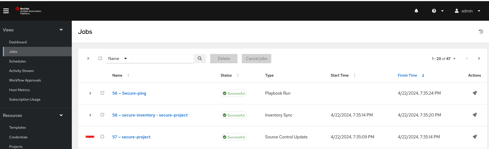
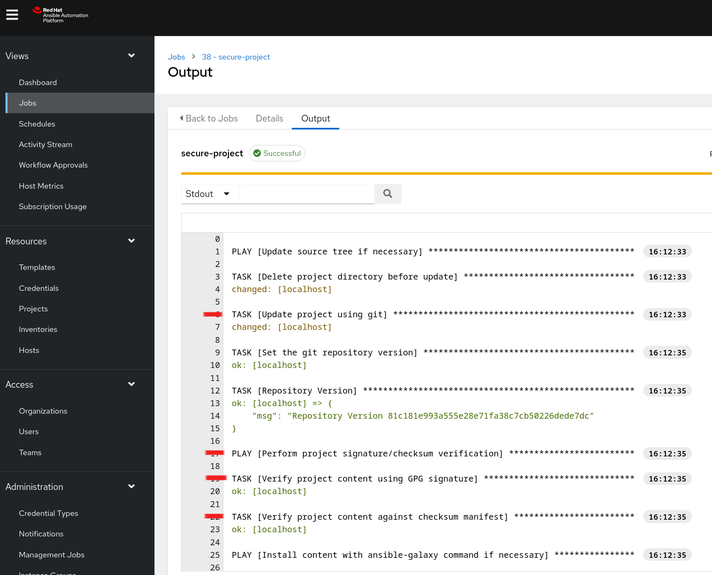

# Demonstration of ansible-sign
To demonstrate Ansible Automation Platforms source validation features:

1. Copy the public key available in this repository, available here: [https://raw.githubusercontent.com/mglantz/ansible-secure-source-demo/main/secure-org_pubkey.asc](https://raw.githubusercontent.com/mglantz/ansible-secure-source-demo/main/secure-org_pubkey.asc)

2. Create a new set of credentials, use GPG key as type and paste in the key you copied in step 1.
[Creating a new set of credentials](images/1_pubkey.png)

3. Create a new project and define the GPG key, ensure to enable "Update revision on project launch".
[Create a new project](images/2_project.png)

4. Create an inventory with your project as source.
[Create an inventory](images/3_inventory.png)

5. Create a job template using the playbooks/ping.yml playbook connected to the inventory you just created.
[Create a job template](images/4_jobtemplate.png)

6. Run the job template.

7. Show how the related playbook (ping.yml) now is cryptographically validated as the project is refreshed, along side with the inventory source you run against. Review run jobs to show the Source Control Update triggered by your job template run.

8. Show the validation which happened during the Source Control Update of your project.

## How ansible-sign works with Ansible Automation Platform
Read more here: https://docs.ansible.com/automation-controller/latest/html/userguide/project-sign.html 

